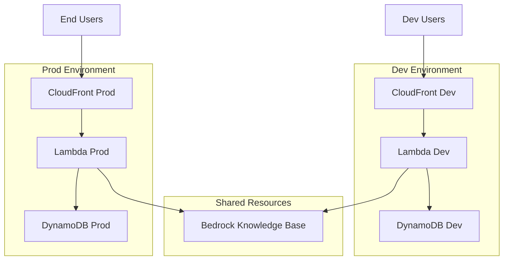
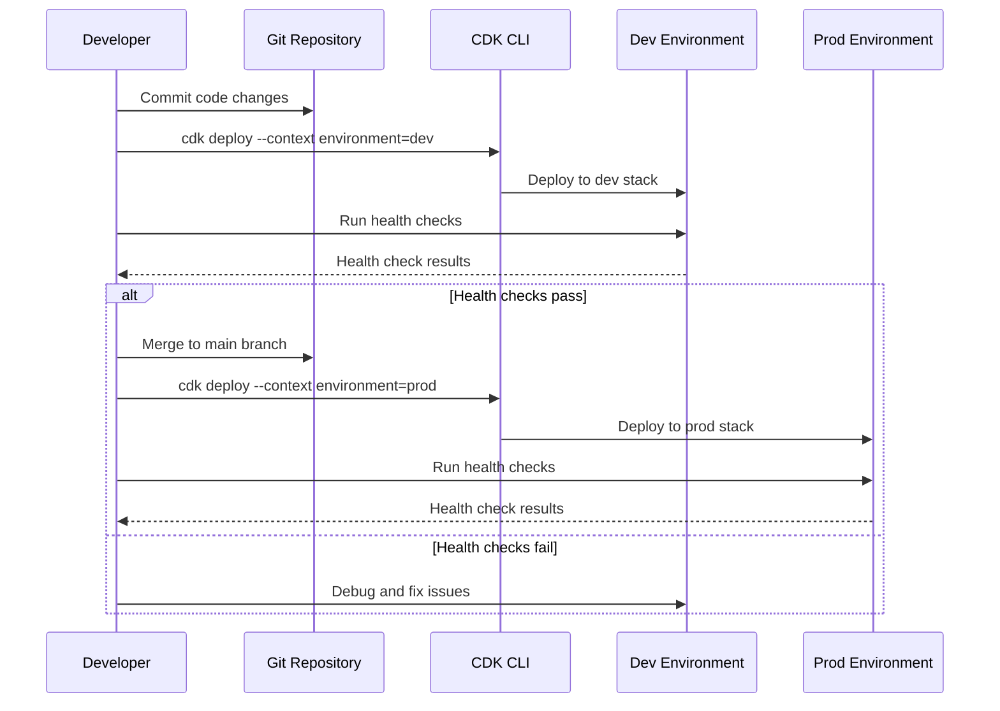

# Design Document: Dev/Prod Environments

## Overview

This design implements separate development and production environments for the Orcutt Schools chatbot while maintaining cost efficiency through shared resources. The solution leverages AWS CDK's existing ENVIRONMENT variable support in config.yaml to provision isolated infrastructure stacks.

The design addresses two key challenges:
1. **Environment Isolation**: Separate Lambda functions, DynamoDB tables, and CloudFront distributions for safe testing
2. **Current State Migration**: Renaming the existing "OrcuttChatbotStack-dev" to "OrcuttChatbotStack-prod" without service disruption

Key design decisions:
- **Shared Knowledge Base**: Both environments use the same Bedrock Knowledge Base to minimize costs (primary cost driver at ~$100-150/month)
- **Environment-based Resource Naming**: All resources include environment suffix for clear identification
- **Zero-downtime Migration**: Use CloudFormation stack renaming with resource retention to preserve production state
- **Simple Health Checks**: Post-deployment validation script to verify environment functionality

## Architecture

### High-Level Architecture



### Environment Separation Strategy

Each environment maintains its own:
- **Lambda Function**: Isolated code execution and configuration
- **DynamoDB Table**: Separate conversation history and session data
- **CloudFront Distribution**: Independent CDN with separate domain
- **IAM Roles**: Environment-specific permissions

Both environments share:
- **Bedrock Knowledge Base**: Single source of truth for content (cost optimization)
- **S3 Bucket for Frontend**: Can be shared or separate based on deployment strategy

### CDK Stack Structure

The CDK application will use the ENVIRONMENT variable from config.yaml to determine which resources to create:

```
cdk.json
config.yaml (contains dev and prod configurations)
lib/
  orcutt-chatbot-stack.ts (main stack)
  constructs/
    lambda-construct.ts
    dynamodb-construct.ts
    cloudfront-construct.ts
    knowledge-base-construct.ts (conditional - only create if doesn't exist)
```

## Components and Interfaces

### 1. CDK Stack Configuration

**Purpose**: Read environment-specific configuration and provision appropriate resources

**Interface**:
```typescript
interface EnvironmentConfig {
  environment: 'dev' | 'prod';
  stackName: string;
  domainName: string;
  lambdaMemory: number;
  dynamoDbBillingMode: 'PAY_PER_REQUEST' | 'PROVISIONED';
  knowledgeBaseId?: string; // Optional - reuse existing KB
}
```

**Behavior**:
- Read ENVIRONMENT variable from CDK context or config.yaml
- Load environment-specific configuration
- Append environment suffix to all resource names
- Conditionally create or reference Knowledge Base

### 2. Lambda Function Construct

**Purpose**: Deploy environment-specific Lambda function with appropriate configuration

**Interface**:
```typescript
interface LambdaConfig {
  functionName: string; // e.g., "OrcuttChatbot-dev"
  memorySize: number;
  environment: {
    ENVIRONMENT: string;
    KNOWLEDGE_BASE_ID: string;
    DYNAMODB_TABLE_NAME: string;
  };
}
```

**Behavior**:
- Create Lambda function with environment-specific name
- Configure environment variables pointing to correct resources
- Set up IAM role with permissions for DynamoDB and Bedrock
- Enable CloudWatch logging with environment-specific log group

### 3. DynamoDB Construct

**Purpose**: Create environment-specific conversation storage

**Interface**:
```typescript
interface DynamoDBConfig {
  tableName: string; // e.g., "OrcuttChatbot-Conversations-dev"
  billingMode: 'PAY_PER_REQUEST' | 'PROVISIONED';
  partitionKey: string;
  sortKey?: string;
}
```

**Behavior**:
- Create table with environment-specific name
- Configure billing mode based on environment (dev can use lower capacity)
- Set up GSIs if needed for conversation queries
- Enable point-in-time recovery for prod environment

### 4. CloudFront Construct

**Purpose**: Deploy environment-specific CDN distribution

**Interface**:
```typescript
interface CloudFrontConfig {
  distributionName: string;
  domainName: string;
  certificateArn: string;
  originLambdaArn: string;
}
```

**Behavior**:
- Create CloudFront distribution with environment-specific configuration
- Configure custom domain (dev subdomain vs prod domain)
- Set up SSL certificate
- Configure origin to point to environment-specific Lambda function URL

### 5. Knowledge Base Construct

**Purpose**: Create or reference shared Bedrock Knowledge Base

**Interface**:
```typescript
interface KnowledgeBaseConfig {
  knowledgeBaseId?: string; // If provided, reuse existing
  knowledgeBaseName?: string; // If creating new
  dataSourceConfig?: {
    webCrawlerConfig: {
      seedUrls: string[];
      crawlDepth: number;
    };
  };
}
```

**Behavior**:
- Check if Knowledge Base ID is provided in config
- If provided, reference existing Knowledge Base
- If not provided, create new Knowledge Base (first deployment only)
- Return Knowledge Base ID for Lambda environment variables

### 6. Health Check Script

**Purpose**: Validate environment functionality after deployment

**Interface**:
```bash
./scripts/health-check.sh <environment>
```

**Behavior**:
- Test Lambda function invocation via CloudFront URL
- Verify DynamoDB table accessibility
- Check Knowledge Base connectivity
- Return exit code 0 for success, 1 for failure
- Output detailed error messages for debugging

## Data Models

### Environment Configuration (config.yaml)

```yaml
environments:
  dev:
    stackName: OrcuttChatbotStack-dev
    domainName: dev-orcutt-ai.techreformers.com
    lambdaMemory: 512  # Lower memory for cost savings
    dynamoDbBillingMode: PAY_PER_REQUEST
    knowledgeBaseId: <existing-kb-id>  # Shared with prod
    
  prod:
    stackName: OrcuttChatbotStack-prod
    domainName: orcutt-ai.techreformers.com
    lambdaMemory: 1024  # Higher memory for performance
    dynamoDbBillingMode: PAY_PER_REQUEST
    knowledgeBaseId: <existing-kb-id>  # Shared with dev
```

### CDK Context

```json
{
  "environment": "dev",  // or "prod"
  "@aws-cdk/core:stackRelativeExports": true
}
```

### Resource Naming Convention

All resources follow the pattern: `{ResourceType}-{Environment}`

Examples:
- Lambda: `OrcuttChatbot-dev`, `OrcuttChatbot-prod`
- DynamoDB: `OrcuttChatbot-Conversations-dev`, `OrcuttChatbot-Conversations-prod`
- CloudFront: `OrcuttChatbot-Distribution-dev`, `OrcuttChatbot-Distribution-prod`
- Stack: `OrcuttChatbotStack-dev`, `OrcuttChatbotStack-prod`

## Migration Strategy

### Current State Analysis

Current production environment:
- Stack Name: `OrcuttChatbotStack-dev` (misnomer - actually serving production)
- Domain: `https://orcutt-ai.techreformers.com`
- CloudFront: `https://d3dolln1x7yei7.cloudfront.net`
- Resources: Lambda, DynamoDB, Knowledge Base, CloudFront

### Migration Approach: Stack Rename with Resource Retention

**Strategy**: Use CloudFormation's resource retention and import capabilities to rename the stack without recreating resources.

**Steps**:

1. **Backup Current State**
   - Export DynamoDB table data
   - Document all resource ARNs and IDs
   - Take CloudFormation template snapshot

2. **Update CDK Code**
   - Modify stack to read from config.yaml
   - Add environment suffix logic to all resources
   - Ensure Knowledge Base is referenced, not recreated

3. **Deploy New Prod Stack**
   - Set ENVIRONMENT=prod in CDK context
   - Deploy with `cdk deploy --context environment=prod`
   - CDK will create new stack: `OrcuttChatbotStack-prod`
   - New resources will be created with `-prod` suffix

4. **Migrate Data**
   - Copy DynamoDB data from old table to new prod table
   - Update DNS to point to new CloudFront distribution
   - Test new prod environment thoroughly

5. **Cutover**
   - Update Route53 or DNS provider to point prod domain to new CloudFront
   - Monitor for issues
   - Keep old stack running for 24-48 hours as backup

6. **Cleanup**
   - Once new prod is stable, delete old `OrcuttChatbotStack-dev` stack
   - This frees up the "dev" name for actual development environment

7. **Deploy New Dev Environment**
   - Set ENVIRONMENT=dev in CDK context
   - Deploy with `cdk deploy --context environment=dev`
   - New dev environment created with `-dev` suffix
   - Uses same Knowledge Base as prod

### Alternative: In-Place Rename (More Complex)

If zero data migration is required:
1. Use CloudFormation change sets to rename resources in place
2. Update stack name through AWS Console or CLI
3. Risk: More complex, potential for errors

**Recommendation**: Use the "Deploy New Prod Stack" approach for safety and clarity.

## Deployment Workflow

### Development Workflow



### Deployment Commands

**Deploy to Dev**:
```bash
cdk deploy --context environment=dev
./scripts/health-check.sh dev
```

**Deploy to Prod**:
```bash
cdk deploy --context environment=prod
./scripts/health-check.sh prod
```

**Diff Before Deploy**:
```bash
cdk diff --context environment=prod
```

## Correctness Properties


*A property is a characteristic or behavior that should hold true across all valid executions of a system—essentially, a formal statement about what the system should do. Properties serve as the bridge between human-readable specifications and machine-verifiable correctness guarantees.*

### Property 1: Knowledge Base Query Consistency

*For any* query to the Knowledge Base, the results returned to Dev_Environment SHALL be identical to the results returned to Prod_Environment.

**Validates: Requirements 2.2**

### Property 2: DynamoDB Data Isolation

*For any* conversation data written to Dev_Environment DynamoDB table, the Prod_Environment DynamoDB table SHALL remain unchanged and contain no records from Dev_Environment.

**Validates: Requirements 5.2**

### Property 3: Resource Naming Convention Consistency

*For all* AWS resources created by the CDK stack (Lambda, DynamoDB, CloudFront), the resource name SHALL follow the format "{ResourceName}-{ENVIRONMENT_Variable}".

**Validates: Requirements 13.1, 13.3**

## Error Handling

### Deployment Errors

**Scenario**: CDK deployment fails due to resource conflicts or configuration errors

**Handling**:
- CDK will automatically rollback failed deployments
- CloudFormation stack will return to previous stable state
- Error messages will indicate which resource failed and why
- Logs available in CloudWatch and CDK CLI output

**Prevention**:
- Use `cdk diff` before deploying to preview changes
- Run health checks after each deployment
- Maintain separate environments to test changes before prod

### Health Check Failures

**Scenario**: Post-deployment health checks fail

**Handling**:
- Health check script returns non-zero exit code
- Script outputs specific failure reason (Lambda timeout, DynamoDB access denied, etc.)
- Developer must investigate and fix before proceeding to prod deployment
- If prod deployment already occurred, rollback using previous CDK deployment

**Prevention**:
- Always run health checks in dev before deploying to prod
- Monitor CloudWatch logs during and after deployment
- Set up CloudWatch alarms for Lambda errors and DynamoDB throttling

### Migration Errors

**Scenario**: Data migration from old stack to new prod stack fails

**Handling**:
- Keep old stack running as backup
- Verify data integrity before DNS cutover
- If migration fails, continue using old stack while debugging
- Use DynamoDB point-in-time recovery if data corruption occurs

**Prevention**:
- Test migration process in dev environment first
- Export DynamoDB data before migration
- Perform migration during low-traffic period
- Have rollback plan documented and ready

### Configuration Errors

**Scenario**: config.yaml contains invalid or missing configuration

**Handling**:
- CDK synthesis will fail with validation error
- Error message indicates which configuration field is invalid
- Deployment will not proceed until configuration is fixed

**Prevention**:
- Validate config.yaml schema before deployment
- Use TypeScript interfaces to enforce configuration structure
- Document required configuration fields

### Resource Quota Errors

**Scenario**: AWS account reaches service quota limits

**Handling**:
- CDK deployment fails with quota exceeded error
- Request quota increase through AWS Support
- Consider consolidating resources or cleaning up unused resources

**Prevention**:
- Monitor AWS service quotas in Service Quotas console
- Request quota increases proactively for known growth
- Clean up unused resources regularly

## Testing Strategy

### Dual Testing Approach

This feature requires both unit tests and property-based tests for comprehensive coverage:

**Unit Tests**: Focus on specific examples, edge cases, and integration points
- CDK stack synthesis with different configurations
- Health check script execution with mocked AWS responses
- Configuration parsing and validation
- Migration script data transformation

**Property Tests**: Verify universal properties across all inputs
- Resource naming convention consistency across all resource types
- Knowledge Base query consistency between environments
- Data isolation between DynamoDB tables

Both testing approaches are complementary and necessary. Unit tests catch concrete bugs in specific scenarios, while property tests verify general correctness across many inputs.

### Property-Based Testing Configuration

**Library**: Use `fast-check` for TypeScript/JavaScript property-based testing

**Configuration**:
- Minimum 100 iterations per property test
- Each test tagged with comment referencing design property
- Tag format: `// Feature: dev-prod-environments, Property {number}: {property_text}`

**Property Test Implementation**:

Each correctness property must be implemented by a single property-based test:

1. **Property 1: Knowledge Base Query Consistency**
   - Generate random queries
   - Execute query against both dev and prod Lambda functions
   - Assert results are identical
   - Tag: `// Feature: dev-prod-environments, Property 1: Knowledge Base Query Consistency`

2. **Property 2: DynamoDB Data Isolation**
   - Generate random conversation data
   - Write to dev DynamoDB table
   - Query prod DynamoDB table
   - Assert prod table does not contain dev data
   - Tag: `// Feature: dev-prod-environments, Property 2: DynamoDB Data Isolation`

3. **Property 3: Resource Naming Convention Consistency**
   - List all resources in both dev and prod stacks
   - For each resource, extract name and verify format
   - Assert all names follow "{ResourceName}-{Environment}" pattern
   - Tag: `// Feature: dev-prod-environments, Property 3: Resource Naming Convention Consistency`

### Unit Testing Strategy

**CDK Stack Tests**:
- Test stack synthesis with dev configuration
- Test stack synthesis with prod configuration
- Test that Knowledge Base is shared (same ID in both stacks)
- Test that Lambda, DynamoDB, CloudFront are separate
- Test resource naming includes environment suffix
- Test IAM permissions are correctly scoped

**Health Check Tests**:
- Test health check script with successful responses
- Test health check script with Lambda failure
- Test health check script with DynamoDB failure
- Test health check script with CloudFront failure
- Test error message clarity

**Configuration Tests**:
- Test config.yaml parsing for dev environment
- Test config.yaml parsing for prod environment
- Test missing configuration fields throw errors
- Test invalid configuration values throw errors

**Migration Tests**:
- Test DynamoDB data export
- Test DynamoDB data import
- Test data integrity after migration
- Test rollback procedures

### Integration Testing

**End-to-End Tests**:
- Deploy to dev environment
- Run health checks
- Make test requests through CloudFront
- Verify responses come from dev Lambda
- Verify data stored in dev DynamoDB
- Repeat for prod environment

**Manual Testing Checklist**:
- [ ] Deploy dev environment successfully
- [ ] Access dev domain and verify chatbot works
- [ ] Check dev DynamoDB table contains test conversations
- [ ] Deploy prod environment successfully
- [ ] Access prod domain and verify chatbot works
- [ ] Verify prod and dev are isolated (separate data)
- [ ] Verify both environments query same Knowledge Base
- [ ] Test migration process in dev environment
- [ ] Verify cost tags are applied to all resources

## Cost Analysis

### Current State
- Single environment: ~$200/month
- Primary cost: Knowledge Base (~$100-150/month)
- Secondary costs: Lambda, DynamoDB, CloudFront (~$50-100/month)

### Projected Costs with Dev/Prod

**Shared Resources**:
- Knowledge Base: ~$100-150/month (unchanged)

**Dev Environment**:
- Lambda (512MB, lower traffic): ~$10-20/month
- DynamoDB (PAY_PER_REQUEST, lower traffic): ~$5-10/month
- CloudFront (lower traffic): ~$5-10/month
- **Dev Total**: ~$20-40/month

**Prod Environment**:
- Lambda (1024MB, production traffic): ~$20-40/month
- DynamoDB (PAY_PER_REQUEST, production traffic): ~$10-20/month
- CloudFront (production traffic): ~$10-20/month
- **Prod Total**: ~$40-80/month

**Total Estimated Cost**: ~$160-270/month

**Cost Increase**: ~$0-70/month (significantly less than doubling due to shared Knowledge Base)

### Cost Optimization Strategies

1. **Shared Knowledge Base**: Saves ~$100-150/month by not duplicating the largest cost driver
2. **Reduced Dev Resources**: Lower Lambda memory and expected lower traffic in dev
3. **Pay-Per-Request DynamoDB**: No idle capacity costs, pay only for actual usage
4. **CloudWatch Log Retention**: Shorter retention period for dev logs (7 days vs 30 days for prod)
5. **Dev Environment Shutdown**: Consider stopping dev environment during off-hours if not needed (requires automation)

### Cost Monitoring

**AWS Cost Tags**:
- All resources tagged with `Environment: dev` or `Environment: prod`
- Enable cost allocation tags in AWS Billing console
- Create cost reports filtered by environment tag

**CloudWatch Metrics**:
- Lambda invocation count and duration
- DynamoDB read/write capacity units
- CloudFront requests and data transfer

**Budget Alerts**:
- Set AWS Budget alert at $250/month (total)
- Set separate alerts for dev ($50) and prod ($150)
- Alert when costs exceed 80% of budget

## Implementation Notes

### CDK Best Practices

1. **Use CDK Context for Environment**: Pass environment via `--context environment=dev` rather than environment variables
2. **Separate Stacks**: Consider using separate CDK apps for dev and prod if they need different deployment schedules
3. **Resource Tagging**: Tag all resources with environment, project, and cost center
4. **IAM Least Privilege**: Each Lambda should only access its own DynamoDB table
5. **CloudFormation Exports**: Avoid cross-stack references between dev and prod

### Security Considerations

1. **IAM Roles**: Separate IAM roles for dev and prod Lambda functions
2. **API Keys**: Different Bedrock API keys/permissions if available
3. **CloudFront**: Consider WAF rules for prod but not dev to save costs
4. **DynamoDB**: Enable point-in-time recovery for prod, optional for dev
5. **Secrets**: Use AWS Secrets Manager with environment-specific secrets

### Monitoring and Observability

1. **CloudWatch Dashboards**: Create separate dashboards for dev and prod
2. **Log Groups**: Separate log groups with environment prefix
3. **Alarms**: Set up alarms for prod (Lambda errors, DynamoDB throttling), optional for dev
4. **X-Ray**: Enable AWS X-Ray tracing for both environments to debug issues
5. **Metrics**: Custom metrics for chatbot-specific KPIs (response time, user satisfaction)

### Documentation Requirements

1. **README.md**: Update with deployment instructions for both environments
2. **MIGRATION.md**: Document migration process from old stack to new prod stack
3. **RUNBOOK.md**: Operational procedures for common tasks (deployment, rollback, debugging)
4. **COST.md**: Cost breakdown and optimization strategies
5. **ARCHITECTURE.md**: Architecture diagrams showing environment separation

## Future Enhancements

### Potential Improvements

1. **CI/CD Pipeline**: Automate deployment with GitHub Actions or AWS CodePipeline
2. **Automated Testing**: Run integration tests automatically after dev deployment
3. **Blue/Green Deployment**: Implement blue/green deployment for zero-downtime prod updates
4. **Canary Deployment**: Gradually roll out changes to prod with traffic shifting
5. **Multi-Region**: Deploy prod to multiple regions for high availability
6. **Staging Environment**: Add third environment for pre-prod testing
7. **Feature Flags**: Implement feature flags to test new features in prod without full deployment
8. **A/B Testing**: Test different prompts or configurations with subset of users

### Scalability Considerations

1. **Lambda Concurrency**: Set reserved concurrency for prod to prevent dev from affecting prod
2. **DynamoDB Auto Scaling**: Consider provisioned capacity with auto-scaling for prod if traffic grows
3. **CloudFront**: Use CloudFront Functions for edge logic if needed
4. **Knowledge Base**: Monitor Knowledge Base performance and consider optimization if query latency increases
5. **Cost Monitoring**: Implement automated cost anomaly detection

## Conclusion

This design provides a robust, cost-effective solution for separating dev and prod environments while maintaining the shared Knowledge Base to minimize costs. The migration strategy ensures zero-downtime transition from the current misnamed "dev" stack to a properly named "prod" stack, with a new dev environment for safe testing.

Key benefits:
- Safe testing environment without affecting production users
- Minimal cost increase (~$0-70/month) due to shared Knowledge Base
- Clear deployment workflow with automated health checks
- Proper environment naming and resource organization
- Comprehensive testing strategy with property-based tests

The implementation follows AWS and CDK best practices, with clear error handling, monitoring, and documentation requirements.
